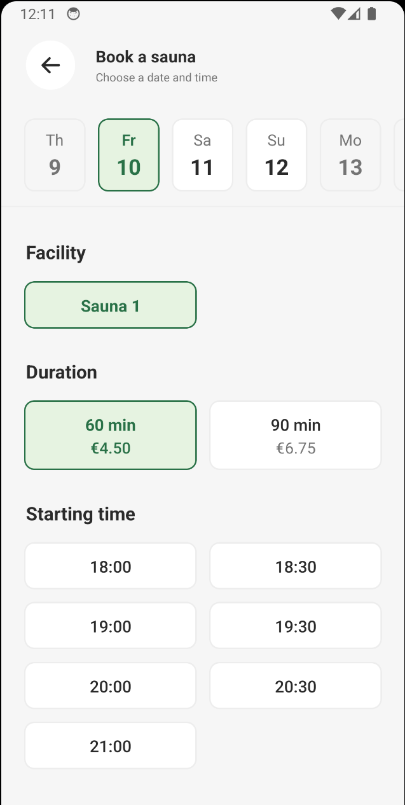

# Developer test
This is a homework assignment for developer recruitment candidates. The purpose of this test is to provide a fair point of comparison between candidates and to help us assess each candidate's skills based on an assignment with which we are familiar. The chosen technologies are similar to those used at Komu, and the task is one we have previously solved ourselves.

## Criteria
When completing the assignment, please pay attention to the following criteria:
* Correctness: Your solution should do exactly what is specified.
* Quality: Your code should follow good practices and demonstrate your craftsmanship.
* Completeness: Consider edge cases.

## Repository
The repository has been prepared to give you a starting point. Run `npm install` and `npm test` to execute the tests. The `src` directory is all yours! Implement your solution and relevant tests there. Split your code into several files as you feel appropriate. Feel free to add any dependencies or tweak the TypeScript configuration if needed.

However, provide a single endpoint for your solution, as the default export from `src/generateSlots.ts`.

## ChatGPT
While we won't prevent you from using AI assistance, please document how and to what extent you used it. Efficiently using tools is a skill, but so is problem-solving, and we want to understand exactly what we are assessing.

## Task
Some time ago, we had to implement a sauna and laundry booking feature in our application. The application received minimal data from the back-end and required a UI that displayed available booking times. The challenge was to generate these available time slots in a user-friendly format.

Your task is to develop an algorithm that generates a list of available time slots based on availability data. You can find the format of the availability data and explanations of each field in `src/types.ts`. The expected return type of the algorithm is also provided there.

For example, consider a facility available on weekends from 18:00 to 20:30. You can make 1-hour bookings, but no more than 7 days in advance, and today is December 12th, 2023. The returned data could be something like this (depending on other parameters):

```JSON
{
    "2023-12-16": [{
        "from": "DateTime(2023-12-16T18:00:00.000Z)",
        "to": "DateTime(2023-12-16T19:00:00.000Z)"
    }, {
        "from": "DateTime(2023-12-16T19:00:00.000Z)",
        "to": "DateTime(2023-12-16T20:00:00.000Z)"
    }],
    "2023-12-17": [{
        "from": "DateTime(2023-12-17T18:00:00.000Z)",
        "to": "DateTime(2023-12-17T19:00:00.000Z)"
    }, {
        "from": "DateTime(2023-12-17T19:00:00.000Z)",
        "to": "DateTime(2023-12-17T20:00:00.000Z)"
    }]
}
```
A few more points:
* The first slot of an availability window must start at the beginning of the window. The subsequent slots must start at the end of the previous slot.
* Dates that have no slots should not be included in the return object.
* Slots must fit entirely inside an availability window.
* If an existing booking overlaps with a slot, the slot must not be returned.
* It's possible for an availability window to span over multiple days.
* In the returned object, a slot should be under the date on which it starts.
* You can assume that availability windows do not overlap each other.

If something is unclear, try to think in the context of real-life scenarios. What are the likely constraints and desired behavior if someone wants to make a single booking for a laundry room or sauna? If the assignment is still unclear, feel free to send us a message.

Use Luxon for date manipulation. It is included in the package.json.

Here's a screenshot of how the data is used in the application, to help you orientate (for this task, we have omitted facility and duration selection):

